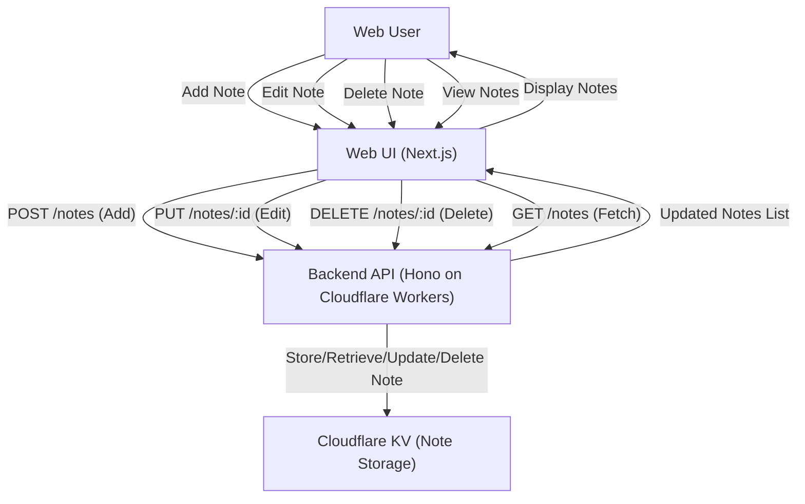

```mermaid
graph TD
  userWeb["Web User"]
  webUI["Web UI (Next.js)"]
  backend["Backend API (Hono on Cloudflare Workers)"]
  storage["Cloudflare KV (Note Storage)"]

  %% User initiates actions
  userWeb -- "Add Note" --> webUI
  userWeb -- "Edit Note" --> webUI
  userWeb -- "Delete Note" --> webUI
  userWeb -- "View Notes" --> webUI

  %% UI sends actions to backend
  webUI -- "POST /notes (Add)" --> backend
  webUI -- "PUT /notes/:id (Edit)" --> backend
  webUI -- "DELETE /notes/:id (Delete)" --> backend
  webUI -- "GET /notes (Fetch)" --> backend

  %% Backend interacts with storage
  backend -- "Store/Retrieve/Update/Delete Note" --> storage

  %% Backend returns results to UI
  backend -- "Updated Notes List" --> webUI

  %% UI updates user
  webUI -- "Display Notes" --> userWeb
``` 