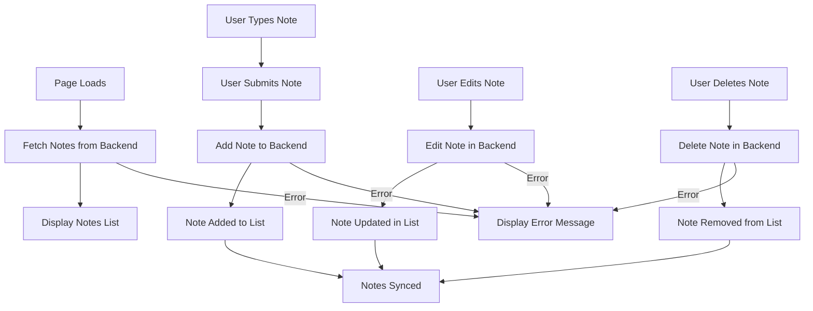

```mermaid
graph TD
  pageLoad["Page Loads"]
  fetchNotes["Fetch Notes from Backend"]
  displayNotes["Display Notes List"]
  userType["User Types Note"]
  userSubmit["User Submits Note"]
  addNote["Add Note to Backend"]
  noteAdded["Note Added to List"]
  userEdit["User Edits Note"]
  editNote["Edit Note in Backend"]
  noteEdited["Note Updated in List"]
  userDelete["User Deletes Note"]
  deleteNote["Delete Note in Backend"]
  noteDeleted["Note Removed from List"]
  syncNotes["Notes Synced"]
  error["Display Error Message"]

  pageLoad --> fetchNotes
  fetchNotes --> displayNotes
  userType --> userSubmit
  userSubmit --> addNote
  addNote --> noteAdded
  noteAdded --> syncNotes
  userEdit --> editNote
  editNote --> noteEdited
  noteEdited --> syncNotes
  userDelete --> deleteNote
  deleteNote --> noteDeleted
  noteDeleted --> syncNotes

  fetchNotes -- "Error" --> error
  addNote -- "Error" --> error
  editNote -- "Error" --> error
  deleteNote -- "Error" --> error
``` 